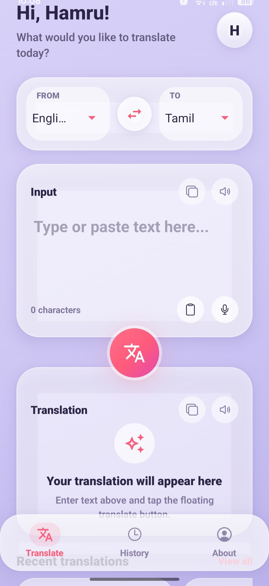
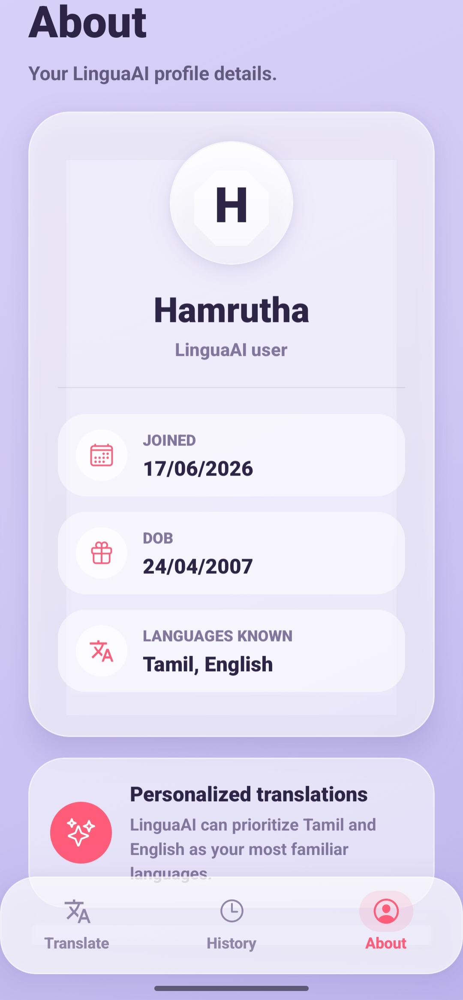

# LinguaAI 🌍

AI-powered translation application built using React Native, Expo, and Google Gemini AI.

LinguaAI is an AI-powered mobile translation application developed using React Native, Expo, TypeScript, and Google Gemini AI. It enables users to translate text across multiple languages, listen to pronunciations, copy translations, and manage translation history through a modern mobile interface.

## Features

- 🌐 Translate between 25+ languages
- 🤖 Gemini AI powered translations
- 🔊 Text-to-Speech pronunciation
- 📋 Copy translated text
- 📚 Translation history
- 📱 Modern mobile UI
- ⚡ Fast and lightweight experience

## Tech Stack

- React Native
- Expo SDK 54
- TypeScript
- Google Gemini AI
- AsyncStorage
- Expo Speech
- Expo Router

## Screenshots

### Home Screen



### Translation Screen


### History Screen


### About Screen



## Download APK

Download the latest APK from the GitHub Releases section.

## Setup

1. Clone the repository

```bash
git clone https://github.com/hamruthasundar/LinguaAI-AI-Powered-Translation-App.git
```

2. Install dependencies

```bash
npm install
```

3. Create a .env file

```env
EXPO_PUBLIC_GEMINI_API_KEY=YOUR_API_KEY
```

4. Start the project

```bash
npx expo start
```

## Highlights

- Supports 25+ languages
- AI-powered contextual translations using Gemini AI
- Text-to-Speech pronunciation support
- Translation history storage
- Copy-to-clipboard functionality
- Modern glassmorphism-inspired UI
- Android APK deployment with EAS Build

## Author

Hamrutha Sundar
